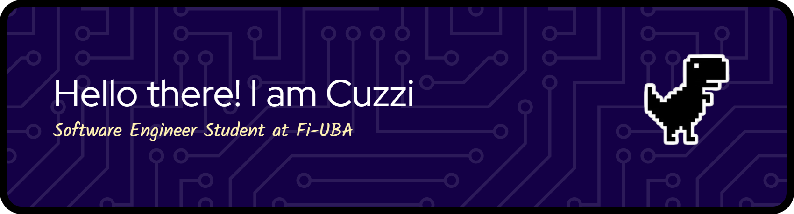

🎓 Software Engineering Student | 💻 Learning every day

---

## 🚀 About Me
- 🌎 From Argentina  
- 📚 Currently studying **Software Engineering**  
- 💡 Curious, experimental, and always learning by building things  
- ⚡ Into **FastAPI**, **React**, **TailwindCSS**, and a bit of **C++**  

---

## 🛠️ Tech Stack
**Languages & Frameworks**  
- Python 🐍 | FastAPI ⚡ | Flask  
- JavaScript ✨ | React ⚛️ | TailwindCSS 🎨  
- C++ ⚙️  

**Tools**  
- Git & GitHub 🐙  
- Docker 🐳  
- VS Code 📝
- IntellijIdea 📝
- Figma 🎨

---

## 📌 Featured Projects
- 🔗 [Portfolio Website](ramiro.boccuzzi.com.ar) – My personal space on the web  
- 📊 [Statistics API](https://github.com/Cuzzi-i/stadistics-by-cuzzi) – FastAPI project with SQLAlchemy  

---

## 🌱 Currently Learning
- Advanced backend patterns with **FastAPI**  
- Building better frontend designs with **Tailwind + React**  
- Exploring **systems programming in C++**  

---

## 📫 Connect with Me
- GitHub: [@Cuzzi-i](https://github.com/Cuzzi-i)  
- LinkedIn: [Ramiro Boccuzzi](https://www.linkedin.com/in/boccuzziramiroa/)

---

⭐️ *Thanks for stopping by my profile! Always open to collaboration and learning new things.*

<!--
**Cuzzi-i/cuzzi-i** is a ✨ _special_ ✨ repository because its `README.md` (this file) appears on your GitHub profile.

Here are some ideas to get you started:

- 🔭 I’m currently working on ...
- 🌱 I’m currently learning ...
- 👯 I’m looking to collaborate on ...
- 🤔 I’m looking for help with ...
- 💬 Ask me about ...
- 📫 How to reach me: ...
- 😄 Pronouns: ...
- ⚡ Fun fact: ...
-->
